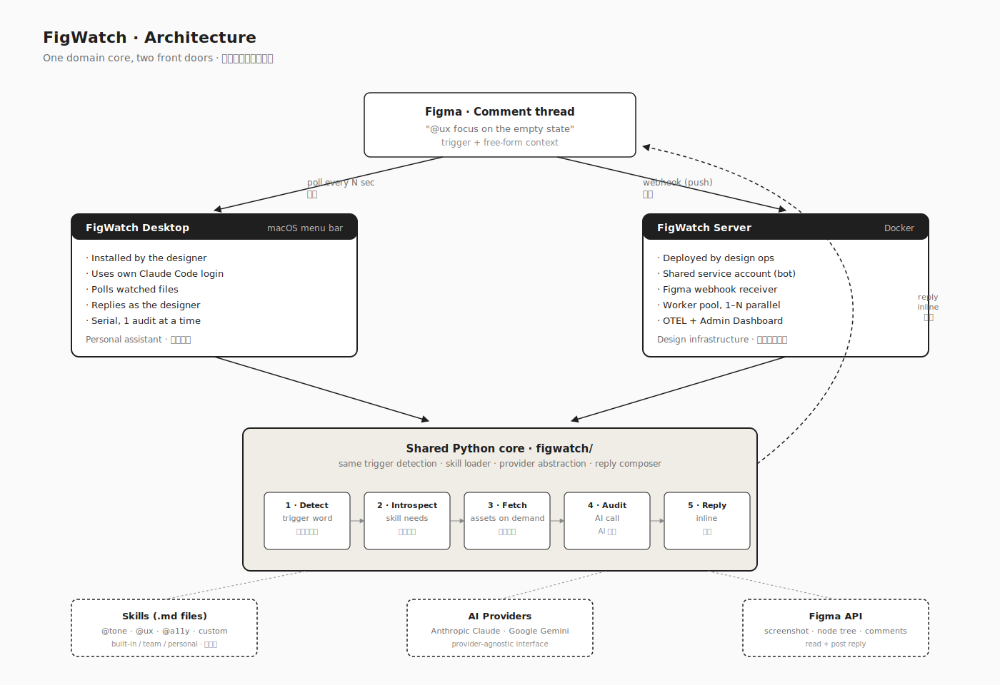
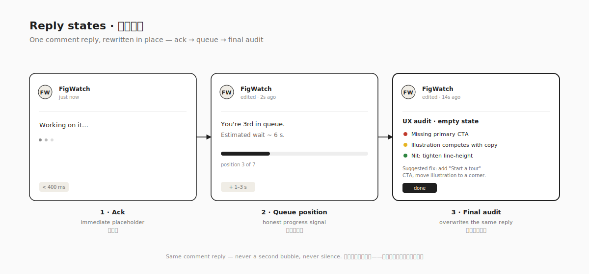

# FigWatch — Product Designer Case Study

> AI-powered Figma comment bot that turns `@ux` / `@tone` mentions into inline design audits.
> AI 驱动的 Figma 评论机器人：在画板上 `@ux` / `@tone`，设计审查直接回到评论里。

| | |
|---|---|
| **Role / 角色** | Product Designer (Lead) — End-to-end design / 端到端产品设计 |
| **Timeline / 周期** | 2025 Q4 – 2026 Q1 · 14 weeks / 14 周 |
| **Platform / 平台** | macOS menu bar app · Docker server / macOS 菜单栏应用 · Docker 服务端 |
| **Team / 团队** | 1 designer · 2 engineers · 1 design ops partner / 1 设计 · 2 工程 · 1 设计运营 |
| **Tools / 工具** | Figma · Figma API · Claude / Gemini · Python · SwiftUI |


*Placeholder: 产品 Hero 图，展示 Figma 画板上的 `@ux` 评论与 FigWatch 回复*

---

## 01 · Overview / 概述

**EN —** FigWatch listens to Figma comment threads. When a designer drops `@ux`, `@tone`, or any custom trigger on a frame, FigWatch fetches the screenshot and node tree, runs an AI-driven audit against the team's own guidelines, and replies directly in the thread within seconds. No tool switching. No copy-pasting screenshots into a chatbot.

**中 —** FigWatch 监听 Figma 评论。当设计师在画板上输入 `@ux`、`@tone` 或任意自定义触发词时，FigWatch 会自动抓取画面与节点结构，根据团队规范跑一次 AI 审查，并在几秒内把结果回到评论里。不切换工具，不再把截图粘贴到 ChatGPT。


*Placeholder: 触发循环示意图：评论 → 触发词识别 → 资产抓取 → AI 审查 → 回复*

---

## 02 · The Problem / 问题背景

**EN —** Designers already use AI for design review. The workflow is familiar: screenshot the frame → switch to ChatGPT → type out the context ("this is an empty state, our tone is playful, ignore the copy for now, focus only on the CTA") → read the reply → switch back to Figma → paste the feedback into a comment. The audit itself isn't the hard part — the **ceremony** around it is. Every frame demands the same app hop, the same re-typed context, the same copy-paste round-trip. On a busy day that overhead eats more minutes than the reviews themselves, and the context gets thinner every time someone is in a hurry.

The pain isn't "AI can't help." It's **"staying in Figma while using AI is impossible,"** and **"I have to re-explain the same context 30 times a day."** FigWatch exists to remove both — no app switch, and the context comes from the comment and the frame that are already there.

**中 —** 设计师早就在用 AI 做设计审查。流程大家都熟：截图当前画板 → 切到 ChatGPT → 手动打一段上下文（"这是空状态、我们的 tone 偏活泼、先忽略文案、只看 CTA"） → 读回复 → 切回 Figma → 再把反馈粘到评论里。审查本身不难，难的是围绕它的**一整套仪式**：每一帧都要切一次应用、重复一次上下文、再粘贴一次截图。一天下来，这些环节吃掉的时间比审查本身还多；而且越赶时间，上下文就越草率。

真正的痛点不是"AI 帮不上忙"，而是**"想留在 Figma 里用 AI 几乎不可能"**，以及**"同一段上下文一天要重复讲三十遍"**。FigWatch 要解决的就是这两件事——不离开 Figma，上下文直接从评论与画板本身读取。

### Interview insights / 访谈洞察

| # | Insight / 洞察 | Design implication / 设计启示 |
|---|---|---|
| 1 | "I screenshot to ChatGPT 30 times a day — typing the same context each time kills me." / "一天往 ChatGPT 发 30 次截图，每次都重打一遍上下文，特别耗。" | Context must be read **from the comment and the frame**, not re-entered by the designer. / 上下文直接从评论与画板读取，而不是让设计师每次重输。 |
| 2 | "I never trust a generic chatbot with our tone." / "不敢把品牌 tone 交给通用聊天机器人。" | Guidelines must be **team-owned**, not baked into the model. / 规则由团队掌握，而非写死进模型。 |
| 3 | "I don't want another dashboard to check." / "不想再多一个要盯的后台。" | Output lives **where the conversation already is** — in Figma. / 结果要出现在已经发生的对话中——Figma 里。 |


*Placeholder: 亲和图整理设计师痛点*

---

## 03 · North-Star Principles / 设计北极星

**EN —** Three principles anchored every decision:

1. **Zero context switch** — the audit happens in the thread it was asked in.
2. **Rules belong to the team** — auditors read `.md` skill files the team owns, not a hidden prompt.
3. **Acknowledge before you answer** — latency is real; perceived latency doesn't have to be.

**中 —** 三条贯穿始终的设计原则：

1. **零上下文切换**——审查在哪被请求，就在哪回复。
2. **规则归团队所有**——审查器读取团队自己维护的 `.md` 规则，而非藏在模型里。
3. **先应答，再给答案**——真实延迟无法消除，但心理延迟可以。


*Placeholder: 三条设计原则海报*

---

## 04 · The Solution / 解决方案

**EN —** One domain core, two front doors.

- **macOS menu bar app (Desktop)** — zero-friction install for individual designers and small teams. Uses the designer's own Claude Code login (no API key to paste), polls the files they care about, and replies from their own account.
- **Docker server** — for design ops. Receives Figma webhooks (no polling), scales with a worker pool, uses a shared service account to reply as a team bot, and emits OpenTelemetry metrics. Ships with an admin dashboard (§7.3).

Both paths share the **same Python core**: detect trigger → introspect skill → fetch only what's needed → run AI audit → reply inline. A skill written once runs identically in either place — teams typically prototype locally on Desktop, then promote the `.md` file to Server for org-wide use.

**中 —** 一个领域内核，两个入口。

- **macOS 菜单栏应用（Desktop）**——面向个人与小团队，零门槛安装。复用设计师已登录的 Claude Code（无需粘贴 API Key），轮询关心的文件，以本人身份回帖。
- **Docker 服务端**——面向设计运营。基于 Figma Webhook（无轮询），通过 worker 池横向扩展，使用共享服务账号以团队机器人身份回帖，输出 OpenTelemetry 指标。随包附带管理后台（见 7.3）。

两条路径共享**同一套 Python 内核**：触发词识别 → 技能自省 → 按需抓取资产 → AI 审查 → 回帖。同一个技能文件在两处行为一致——团队通常在 Desktop 上本地原型，成熟后把 `.md` 文件提升到 Server 供全员使用。


*Architecture: two deployment shells around one Python core.*
*架构：共享 Python 内核 + 两层部署外壳。*

---

## 05 · Key Design Decisions / 关键设计决策

### 5.1 Skills are Markdown, not code / 规则用 Markdown，不是代码

**EN —** The team shouldn't fork a repo to add an accessibility audit. Skills are `.md` files dropped into `~/.figwatch/skills/`. FigWatch introspects each file once, asks the AI "what inputs does this skill need?" (screenshot? node tree? text nodes?), caches the answer, and hot-reloads without restart. Adding `@a11y` takes a designer 10 minutes, not a sprint.

**中 —** 团队不应该为了加一个无障碍审查而 fork 代码库。技能就是 `~/.figwatch/skills/` 里的 `.md` 文件。FigWatch 首次加载时让 AI 自检"这个技能需要什么输入？"（截图？节点树？文本节点？），缓存结果并热加载。加一个 `@a11y` 只要设计师 10 分钟，而不是一个 sprint。


*Placeholder: 技能文件机制示意*

### 5.2 Immediate acknowledgement / 先回一句"在看了"

**EN —** AI calls take 8–20 seconds. Silence reads as broken. FigWatch replies within 400 ms with "Working on it…", updates with queue position ("You're 3rd in queue"), then rewrites the ack with the final audit. Perceived latency collapses.

**中 —** AI 调用耗时 8–20 秒。沉默在用户眼里就是"坏了"。FigWatch 在 400ms 内先回"Working on it…"，随后更新队列位置（"你排在第 3 位"），最后用审查结果覆盖占位回复。感知延迟骤降（见 §5.3 的图）。

### 5.3 Behave like a teammate, not a tool / 像同事，而非机器人

**EN —** Every interaction follows the social rules of a human reviewer, not a bot's:

- **Input is a mention, not a command.** `@ux` tags FigWatch the same way you'd tag a colleague — same autocomplete, same visual treatment, no slash menu to learn. Designers don't onboard to a new UI; they just @ someone new.
- **Output is one reply, rewritten in place.** The ack, the queue update, and the final audit all overwrite the same comment. Never a second bubble, never a notification storm — exactly how a thoughtful reviewer edits their own message as they think.

The cumulative effect: FigWatch reads like a coworker who happens to be fast, not an AI bolted onto the side of Figma.

**中 —** 每一次交互都遵守真人审查者的社交规则，而非机器人规则：

- **输入是提及，而不是命令。** `@ux` 就像 @ 一位同事，用的是 Figma 原生的 mention 自动补全，没有 slash 菜单、没有新语法要学。设计师不是在适应一个新工具，而是多 @ 了一个人。
- **输出是一条回复，原地改写。** 占位应答、队列更新、最终审查——全部覆盖同一条评论。永远不会多出第二个气泡，也不会刷屏通知——就像一个认真的审查者会边想边编辑自己的留言一样。

叠加起来的结果：FigWatch 读起来像一个恰好很快的同事，而不是 Figma 边上硬塞进来的 AI。


*Same comment reply — ack → queue → final audit, all rewritten in place.*
*同一条回复——占位、排队、最终审查，全部原地改写。*

### 5.4 Context-aware triggers / 评论即上下文

**EN —** A trigger alone is a blunt instrument. Designers can append free-form context to the comment — "`@ux` focus on the empty state", "`@tone` this is for existing premium users", "`@a11y` ignore the placeholder copy, review the button only". FigWatch passes that context straight into the audit prompt, so the reply narrows its scope, adjusts its voice, or ignores irrelevant regions. Same trigger, different answer — shaped by whatever the designer types after it.

**中 —** 只有触发词太粗暴。设计师可以在评论里追加自由文本作为上下文——"`@ux` 重点看空状态"、"`@tone` 这是给高端付费用户的"、"`@a11y` 忽略占位文字，只审查按钮"。FigWatch 会把这段上下文直接注入审查 prompt，让回复收缩范围、调整语气、或跳过无关区域。同一个触发词，不同上下文，得到不同答案。


*Placeholder: 同一个 `@ux`，追加不同上下文得到不同审查结果*

---

## 06 · Interaction Flow / 交互流程

**EN —** The end-to-end flow for a `@ux` audit:

**中 —** 一次 `@ux` 审查的端到端流程：

```
Designer types "@ux" in Figma comment
设计师在 Figma 评论中输入 "@ux"
            ↓
Webhook / Poll detects new comment
Webhook / 轮询识别到新评论
            ↓
FigWatch posts "Working on it..." (< 400 ms)
FigWatch 先回"正在处理…"（< 400 毫秒）
            ↓
Skill introspection → fetch screenshot + node tree
技能自省 → 抓取截图 + 节点树
            ↓
AI audit (Claude / Gemini) against team heuristics
按照团队启发式规则跑 AI 审查
            ↓
Reply rewritten with severity-scored findings
用带严重度评分的审查结果覆盖占位回复
```


*Placeholder: `@ux` 完整流程图*

---

## 07 · Interface Highlights / 界面重点

### 7.1 Menu bar as a quick reference / 菜单栏即速查面板

**EN —** The menu bar answers two questions a designer asks mid-work: *"which files am I watching?"* and *"what triggers can I use right now?"* Watched files list with one click to open in Figma; active triggers list with the skill name and source (built-in / team / personal). No status log, no dashboard — just "what's on" and "what I can type."

**中 —** 菜单栏只回答设计师工作时最常想问的两个问题：*"我在监听哪些文件？"* 和 *"我现在能用哪些触发词？"* 被监听文件一键跳转到 Figma；可用触发词列出技能名与来源（内置 / 团队 / 个人）。没有状态日志，也没有后台——只有"开着什么"与"能输入什么"。


*Placeholder: 菜单栏——被监听文件 + 当前可用的触发词列表*

### 7.2 Onboarding as a trust-builder / 引导即信任建立

**EN —** Four steps: install Claude Code → sign in → paste Figma token → pick locale. Each step lives as a checklist item that turns green when verified. The app never silently assumes a step succeeded.

**中 —** 四步走：安装 Claude Code → 登录 → 粘贴 Figma Token → 选择 Locale。每一步都是可勾选项，校验通过才会变绿。应用永远不会"默认一切正常"。


*Placeholder: 引导清单四步*

### 7.3 Admin dashboard for design ops / 面向设计运营的管理后台

**EN —** Individual designers live in the menu bar; design ops live in the dashboard. A separate surface — shipped with the Docker server — gives leads a single view of **skill usage** (which triggers are used, by whom, how often) and **performance** (median audit time, success rate, provider cost, queue depth). Skills can be sorted by ROI: a `@tone` skill fired 400 times a week with a 98% success rate reads very differently from an `@i18n` skill fired 8 times with a 50% retry rate. The dashboard exists so design ops can *retire bad skills, promote good ones, and budget AI spend* — without reading logs.

**中 —** 个人设计师住在菜单栏，设计运营住在 Dashboard。随 Docker 服务端一起发布的独立管理后台，向设计负责人提供一个统一视图：**技能使用情况**（哪些触发词被谁、以什么频率使用）和**性能指标**（审查耗时中位数、成功率、Provider 成本、队列深度）。技能可以按 ROI 排序：一周被调用 400 次、成功率 98% 的 `@tone`，和一周只用 8 次、重试率 50% 的 `@i18n`，一眼就能分辨。Dashboard 的价值在于——让设计运营可以*淘汰低效技能、推广高效技能、合理预算 AI 支出*，而不用翻日志。


*Placeholder: 管理后台——技能使用与性能监控*

### 7.4 Audit reply composition / 审查回复排版

**EN —** Replies are structured: **Summary → Findings with severity (🔴 high / 🟡 medium / 🟢 nit) → Suggested fix**. Long threads collapse. Designers skim in 5 seconds.

**中 —** 回复采用固定结构：**摘要 → 带严重度标签的问题清单（🔴 高 / 🟡 中 / 🟢 小）→ 修改建议**。长线程自动折叠，5 秒内扫完。


*Placeholder: 一条审查回复的结构拆解*

---

## 08 · Outcome / 成果

**EN —**

- **30–120 s → ~15 s** average first-round audit time per frame.
- **2 built-in skills** shipped (`@tone`, `@ux`) · **3 community skills** contributed in the first month (`@a11y`, `@i18n`, `@copy-length`).
- **Zero** additional dashboards introduced into the design workflow.
- **5 locales** supported at launch with team-owned tone rules.

**中 —**

- 单帧首轮审查耗时从 **30–120 秒 → 约 15 秒**。
- 上线时内置 **2 条审查技能**（`@tone`、`@ux`）；上线首月社区贡献 **3 条**（`@a11y`、`@i18n`、`@copy-length`）。
- 设计工作流里**没有**新增任何后台面板。
- 首发支持 **5 个地区**，Tone 规则完全由团队掌握。


*Placeholder: 单帧审查耗时前后对比*

---

## 09 · Reflection / 反思

**EN —** The hardest design problem wasn't "what should the audit look like" — it was "where does the audit live." The moment we stopped designing a dashboard and started designing a reply, everything got simpler. The menu bar and the Docker server became the *same product* viewed from two angles, because the real product was a sentence in a comment thread.

**中 —** 最难的设计问题不是"审查长什么样"，而是"审查住在哪儿"。当我们停止设计一个后台、转而设计一条回复的那一刻，一切都简单了。菜单栏与 Docker 服务端不再是两个产品，而是同一个产品的两个切面——因为真正的产品，是评论线程里的一句话。


*Placeholder: 收尾图——评论线程才是真正的产品表面*

---

*Case study v1.0 · 2026-04 · Written for portfolio use.*
*案例研究 v1.0 · 2026-04 · 作品集用稿。*
