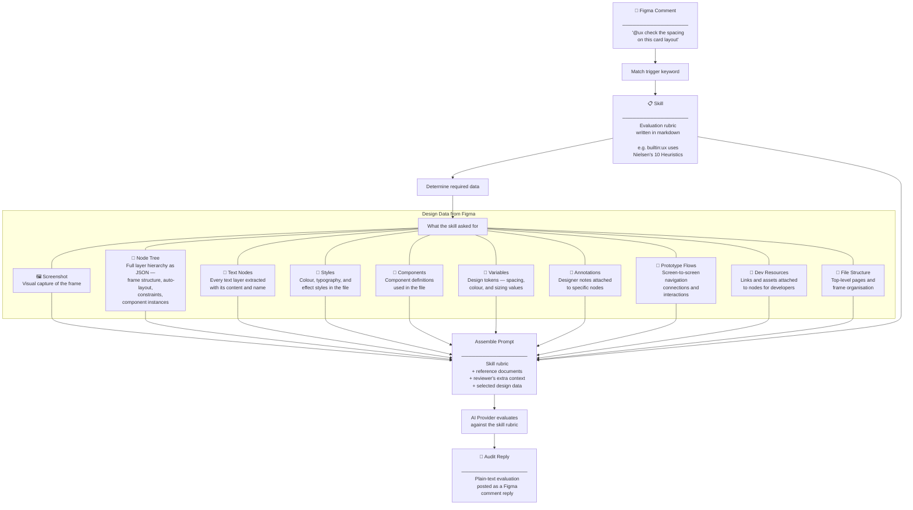

# Domain Logic

How a Figma comment becomes an AI audit reply.

## Audit Production

A comment containing a trigger keyword (e.g. `@ux`, `@tone`) is matched to a **skill** — a markdown rubric that tells the AI what to evaluate and how. The skill declares what design data it needs, that data is fetched from Figma, and everything is assembled into a prompt for the AI provider.

### Builtin skills

| Skill | Trigger | What it evaluates | Data it needs |
|-------|---------|-------------------|---------------|
| **UX Heuristic Review** | `@ux` | Nielsen's 10 Usability Heuristics — cross-references the visual screenshot against the structural node tree | Screenshot, Node Tree |
| **Tone of Voice Review** | `@tone` | Copy against locale-specific brand guidelines (DE, FR, NL, Benelux) with reference docs per locale | Node Tree, Text Nodes |

Custom skills can be added as markdown files. Each skill is introspected to determine which design data types it requires — only the data it asks for is fetched.
